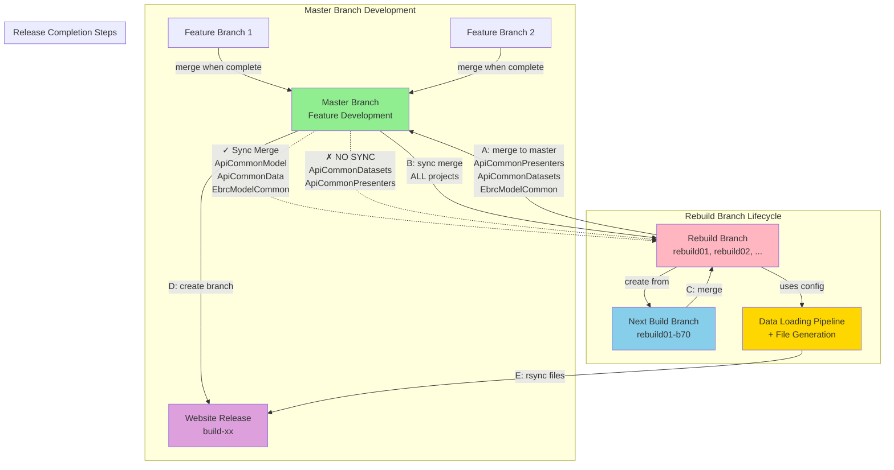

# # 🔄 Git Branching Strategy: Data Loading Rebuild Workflow

## 📚 Repository Categories

### ✅ Sync-Allowed Repositories
**CAN** sync merge from master during rebuild:
- ApiCommonModel
- ApiCommonData
- EbrcModelCommon

### 🚫 Sync-Forbidden Repositories
**MUST NOT** sync from master during rebuild:
- ApiCommonDatasets
- ApiCommonPresenters

*Syncing would invalidate data loading pipelines*

---

## 🔀 Workflow Diagram



---

## 🔄 Detailed Workflow Phases

### Phase 1: During Rebuild (rebuild01 active)

#### Feature Development
Features are developed on branches from master and merged back to master when complete.

#### Selective Sync Merging
- ✅ **CAN** sync merge from master → rebuild01 for:
  - ApiCommonModel
  - ApiCommonData
  - EbrcModelCommon

- 🚫 **MUST NOT** sync from master → rebuild01 for:
  - ApiCommonDatasets
  - ApiCommonPresenters

#### Data Loading
Data loaders always load datasets configured from the rebuild branch (rebuild01). The workflow pipeline populates the relational database and also dumps webservice and download files.

#### Next Increment Branch
Create rebuild01-b70 (or similar) FROM rebuild01 for datasets/presenters to be included in the next incremental build.

---

### Phase 2: When Rebuild Completes

#### Step A - Merge to Master
Merge the following from rebuild01 → master:
- ApiCommonPresenters
- ApiCommonDatasets
- EbrcModelCommon

#### Step B - Sync All Projects
Sync merge from master → rebuild01 for **ALL** projects (now that rebuild data is in master).

#### Step C - Merge Next Build
Merge the next build branch (e.g., rebuild01-b70) → rebuild01.

#### Step D - Create Website Release Branch
Create a website release branch (build-xx) from master for deployment.

#### Step E - Deploy Webservice and Download Files
Rsync webservice and download files (dumped from the data loading pipeline) for use on the website application.

---

## ⚠️ Critical Rule

**ApiCommonDatasets and ApiCommonPresenters must NEVER be synced from master during an active rebuild.** Doing so would invalidate the data loading pipelines. These repositories are only merged TO master when the rebuild completes, then synced back.

---

## 📋 Quick Reference Table

| Repository | Sync from Master During Rebuild? | Merge to Master at Completion? |
|------------|----------------------------------|-------------------------------|
| ApiCommonModel | ✅ Yes | No (already in master) |
| ApiCommonData | ✅ Yes | No (already in master) |
| EbrcModelCommon | ✅ Yes | ⚠️ Yes (Step A) |
| **ApiCommonDatasets** | **🚫 NO** | ⚠️ Yes (Step A) |
| **ApiCommonPresenters** | **🚫 NO** | ⚠️ Yes (Step A) |

---

## 🔑 Key Concepts

### Branch Types

1. **master** - Main development branch
   - Receives feature merges
   - Source for website release branches
   - Receives rebuild completion merges

2. **rebuild01, rebuild02, ...** - Full database rebuild branches
   - Created from master
   - Used by data loading pipeline
   - Selectively sync'd from master
   - Source for next increment branches

3. **rebuild01-b70** - Next increment branch
   - Created FROM rebuild branch
   - Contains datasets/presenters for next build
   - Merged back to rebuild branch at completion

4. **build-xx** - Website release branches
   - Created from master after rebuild completes
   - Receives rsync'd files from data loading pipeline

### Data Flow

```
Rebuild Branch (rebuild01)
    ↓
Data Loading Pipeline
    ↓
Database + Files (webservice & downloads)
    ↓
Files rsync'd to Website Release Branch (build-xx)
```

---

## 📝 Step-by-Step Checklist

### During Active Rebuild
- [ ] Feature branches merge to master as completed
- [ ] Sync merge master → rebuild01 (ApiCommonModel, ApiCommonData, EbrcModelCommon ONLY)
- [ ] Create next increment branch (e.g., rebuild01-b70) from rebuild01
- [ ] Data loading runs from rebuild01 branch

### When Rebuild Completes
- [ ] **Step A:** Merge rebuild01 → master (ApiCommonPresenters, ApiCommonDatasets, EbrcModelCommon)
- [ ] **Step B:** Sync merge master → rebuild01 (ALL projects)
- [ ] **Step C:** Merge next increment (rebuild01-b70) → rebuild01
- [ ] **Step D:** Create website release branch (build-xx) from master
- [ ] **Step E:** Rsync webservice and download files to website application

---

## 🎯 Summary

This branching strategy enables:
- **Parallel development**: Features continue on master while rebuilds proceed
- **Data integrity**: Protected datasets/presenters on rebuild branches
- **Incremental planning**: Next build prepared while current build runs
- **Clean releases**: Website branches created after data is validated and merged
- **File deployment**: Generated files from pipeline deployed to website branches


